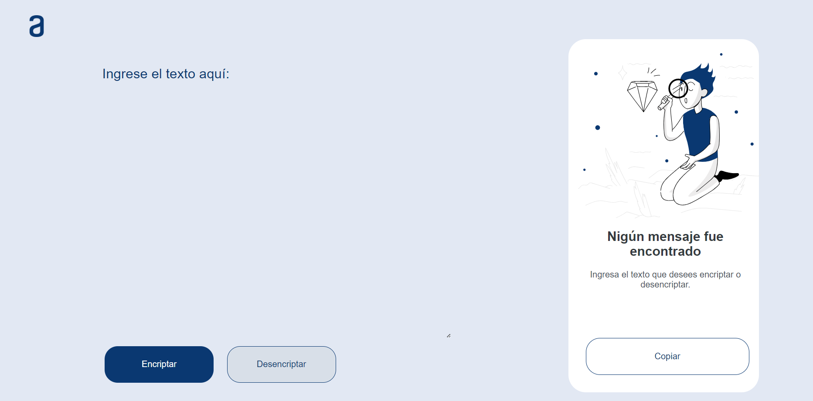
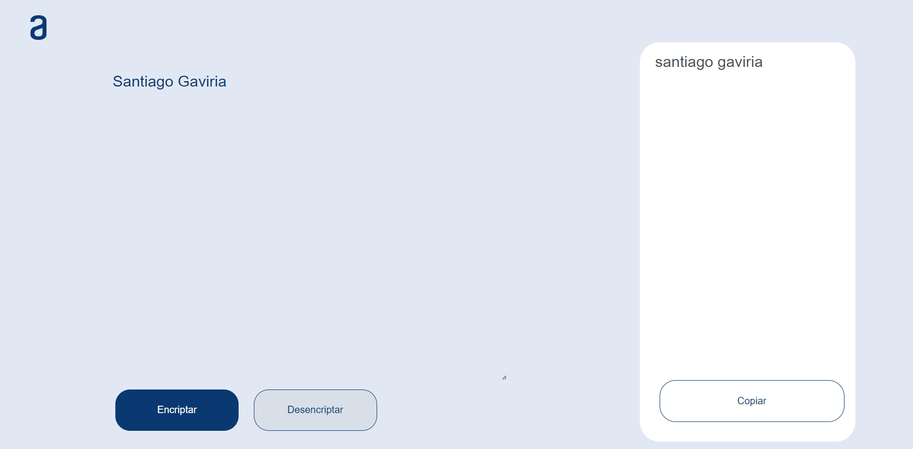
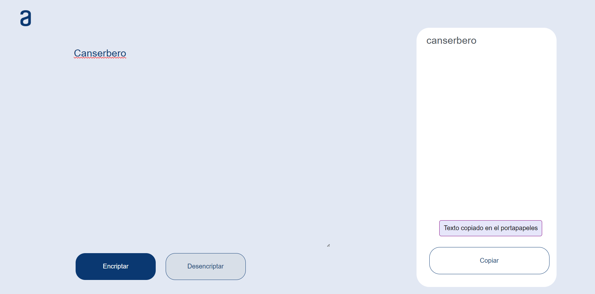

# Challenge Encriptador
En este repositorio se encuentran los archivos del Challenge del encriptador de texto:
- Html
- Css
- JavaScript

### Imagenes
- Pantalla principal:
<div align="center"> 
  


</div>

- Prueba de cuando se ingresa una palabra y se da click al boton encriptar:
<div alig="center">
  


</div>

- Prueba despues de que se encripto la palabra y se da click al boton desencriptar:
<div alig="center">
  


</div>

Claramente se ve que la palabra se desencripta, pero no se encuentran las letras mayusculas ya que se utiliza una funcion lowercase.

-Prueba de cuando se desencripta la palabra y se copia al portapeles:
<div alig="center">
  


</div>

Despues de esto se realizo unas validaciones para que  solamente entrará las paralabras tienen más de dos caracteres:
- Variables utilizadas:
```javascript
const textarea = document.getElementById("textarea")
const btnEncriptar = document.getElementById("btn_Encriptar")
var resultado = document.querySelector(".texto_resultado")
```
Luego de esto editamos el evento del boton encriptar de esta forma:
- Evento boton Encriptar:
```javascript
document.getElementById('btn_Encriptar').addEventListener('click', function() {
    if(textarea.value.trim().length >=2){
        btnEncriptar.disable = true;
        ocultar_contenedor();
        var texto = obtener_texto();
        resultado.textContent = encriptar_Texto(texto);
    }else{
        btnEncriptar.disable = false;
        mostrarMensaje("Ingrese por favor la palabra");
    }
});
```
